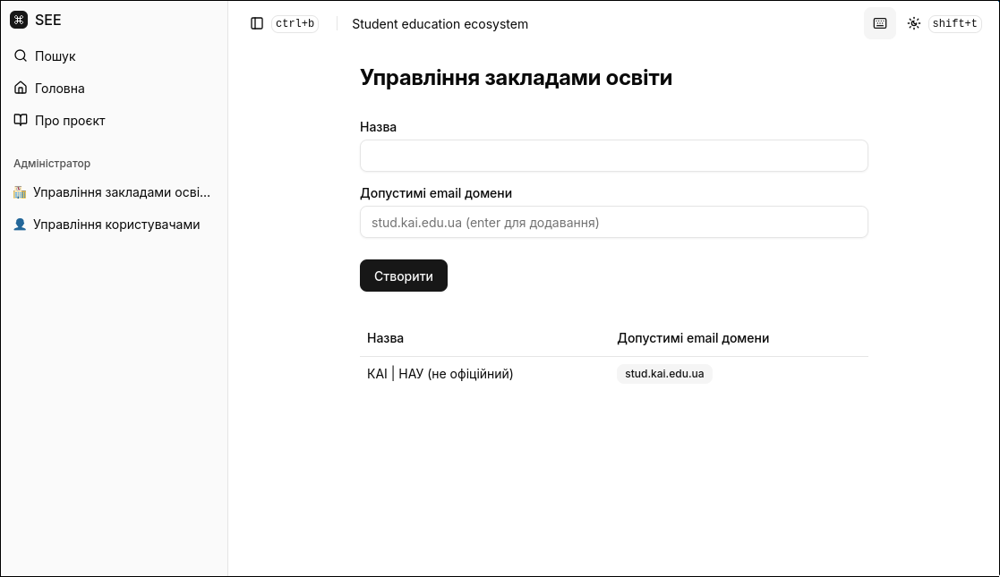
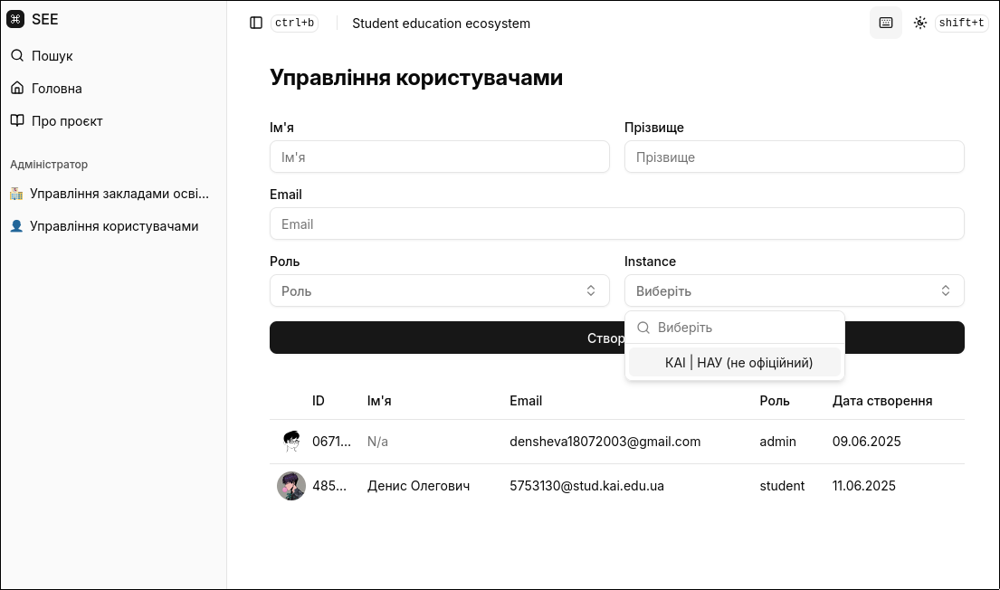
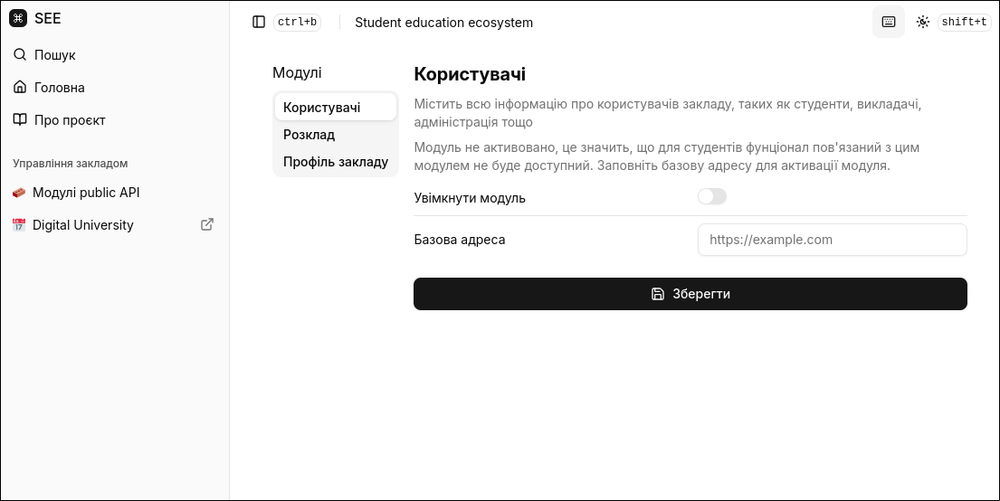
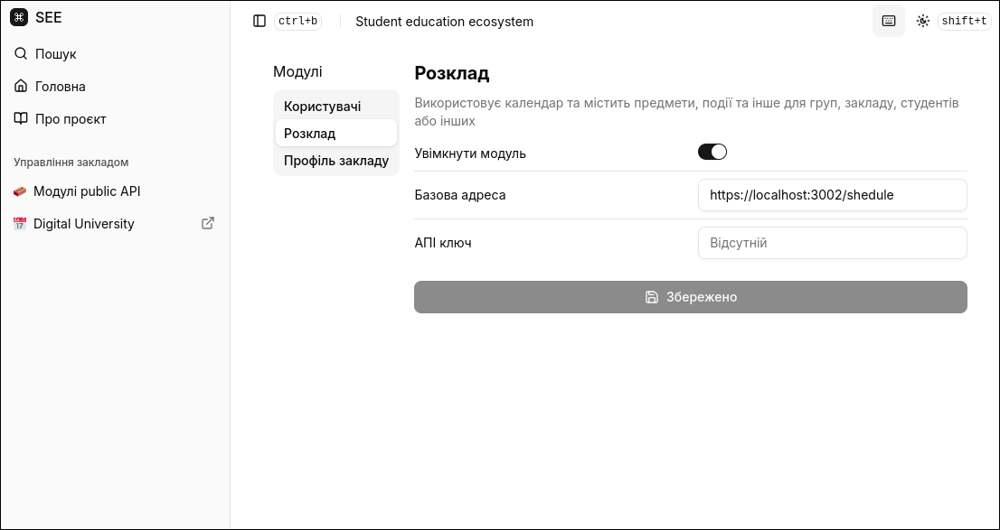
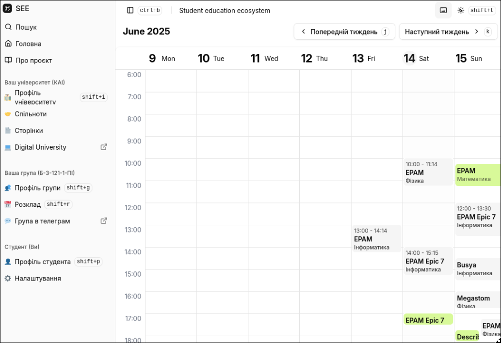

# Education ecosystem

## Introduction

This project is an **Education Ecosystem** designed to connect students with their educational institutions through a centralized platform.

The main components are:

- **student-frontend**: The user interface for students.
- **central-management-service (CMS)**: A central service that acts as a proxy between the student frontend and institution-specific servers.
- **Institution Instance**: A separate server deployed by each educational institution, exposing a public API (e.g., `non-official-nau`).

The CMS interacts with the public APIs of institutional instances to fetch and manage data. This allows institutions to control their own data while providing students with a unified experience.

System administrators can register new institutions. Institution administrators can then configure the connection between their instance's API and the CMS.

## Structure

### Central management service

> Architecture: Modular

```
central-management-service/
|- src/
|  |- api/
|  |- shared/
|  |- app.module.ts
|  |- main.ts
|- ... (config files)
```

### Student Frontend

> Architecture: Evolution design

```
student-frontend/
|- src/
|  |- app/
|  |- features/
|  |- shared/
|- public/
|- ... (config files)
```

### Institution Instance (non-official-nau)

```
instances/non-official-nau/backend/
|- src/
|  |- api/
|  |- shared/
|  |- app.module.ts
|  |- main.ts
|- ... (config files)
```

## Images

### Admin Panel


_Admin panel - Institutions_


_Admin panel - Users_

### Institution Configuration


_Institution - Modules_


_Institution - Module Enabled_


_Institution - Schedule_
